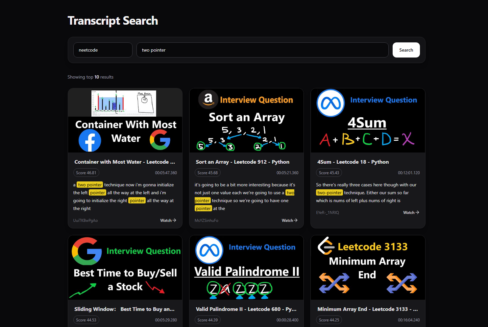

# yt-transcript-search

Search YouTube video transcripts with Elasticsearch and open results directly at the matching timestamp.

This project downloads English subtitles from a YouTube playlist, cleans and chunks the transcripts, indexes them into Elasticsearch, and provides a small search API plus a React frontend for querying results.



## Why this exists

YouTube search is good at finding videos, but not _where_ something is explained inside a video.

This project treats video transcripts as a searchable text corpus so you can:

- search across an entire playlist
- find the exact moment a concept is mentioned
- jump directly to that timestamp

## Features

- Download captions from an entire YouTube playlist with `yt-dlp`
- Support for uploaded subtitles and auto-generated subtitles
- Clean and normalize WebVTT transcript files
- Remove common subtitle noise like `[Music]` and speaker markers
- Split transcripts into short overlapping chunks for better retrieval
- Index transcript chunks in Elasticsearch
- Search by transcript text and video title
- Return links to YouTube timestamps
- Simple React frontend for querying an index and viewing results

## How it works

The pipeline is split into three main steps:

### 1. Download transcripts

- `download.py` downloads English `.vtt` subtitle files for every video in a playlist

### 2. Process and index

- `process.py`:
    - cleans subtitle files
    - removes duplicates / overlaps
    - chunks transcripts into short overlapping segments (~10–12 seconds)
    - indexes everything into Elasticsearch

**Why chunking matters:**  
Instead of indexing an entire video as one document, splitting into small overlapping chunks allows the system to return precise timestamp-level matches instead of full videos.

### 3. Search

- `search.py` exposes a Flask API that queries Elasticsearch
- the `website` folder contains a React frontend

The search combines:

- exact phrase matches (precision)
- broader keyword matches (recall)
- title matches (light boost)

This helps balance finding _exact explanations_ vs _related context_.

## Project structure

```txt
.
├── download.py          # Download playlist transcripts with yt-dlp
├── process.py           # Clean, chunk, and index transcripts into Elasticsearch
├── search.py            # Flask search API
├── requirements.txt     # Python dependencies
├── .env.example         # Elasticsearch environment variables
├── evaluation/          # Evaluation-related files
└── website/             # React frontend
```

## Requirements

- Python 3.10+
- Node.js 22+
- An Elasticsearch instance
- An Elasticsearch API key

## Environment variables

1. Copy the example environment file:

```bash
cp .env.example .env
```

2. Modify the values in `.env` as needed:

```env
ELASTICSEARCH_URL=
ELASTIC_API_KEY=
```

## Installation

### 1. Clone the repository

```bash
git clone https://github.com/zandonella/yt-transcript-search.git
cd yt-transcript-search
```

### 2. Install Python dependencies

```bash
pip install -r requirements.txt
```

### 3. Install frontend dependencies

```bash
cd website
npm install
```

## Usage

### Step 1: Download transcripts

```bash
python download.py
```

You will be prompted for:

- output directory
- YouTube playlist URL

### Step 2: Process and index

```bash
python process.py
```

You will be prompted for:

- transcript directory
- collection name (used as Elasticsearch index)

Example:

```
algorithms
```

### Step 3: Start the search API

```bash
python search.py
```

Endpoint:

```
GET /search
```

Query params:

- `q` — search query
- `index` — index name
- `size` — optional result count, default 10

Example:

```
http://127.0.0.1:5000/search?index=algorithms&q=two+pointer
```

### Step 4: Start the frontend

```bash
cd website
npm run dev
```

## Result format

Each result includes:

- Elasticsearch score
- video title + ID
- timestamp range
- transcript snippet
- highlighted matches
- direct YouTube link to that moment

## Example workflow

1. Download transcripts from a playlist (for example, algorithms videos)
2. Index them
3. Start the API + frontend
4. Search for:
    - `dynamic programming`
    - `two pointer`
    - `binary search`

You’ll get results that jump directly to where those concepts are explained.

## Notes

- English subtitles only (currently)
- Auto-generated captions can contain errors
- Videos without transcripts cannot be indexed
- Re-running `process.py` will overwrite the index

## Potential Future improvements

- Semantic search (vector / embeddings)
- Better handling of ambiguous queries (e.g. "binary search" vs "binary search tree")
- Docker / deployment setup / single script to run
- Improved UI filtering

## Tech stack

- Python
- yt-dlp
- webvtt-py
- Elasticsearch (BM25)
- Flask
- React + Vite

## Author

Built by [Michael Zandonella](https://zando.dev/)
